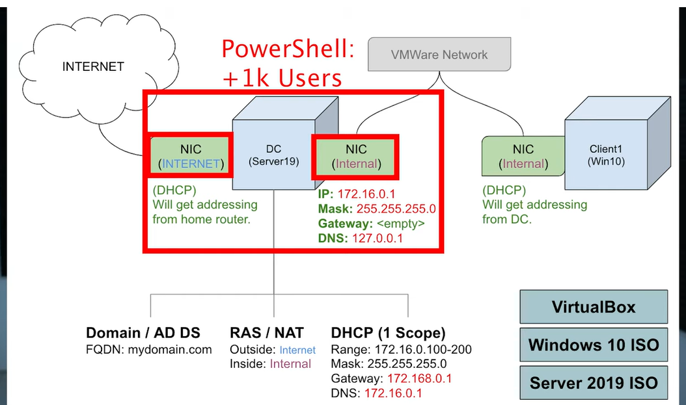
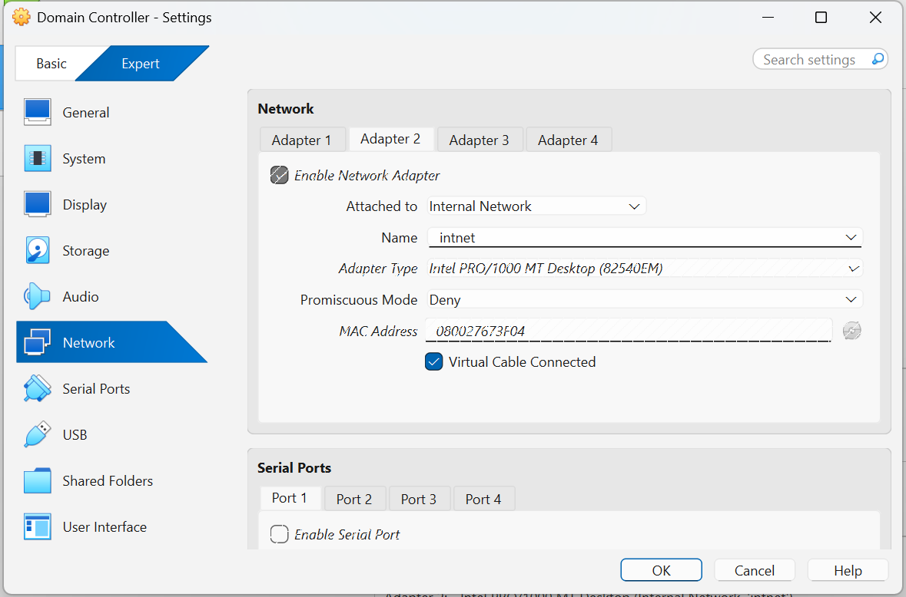
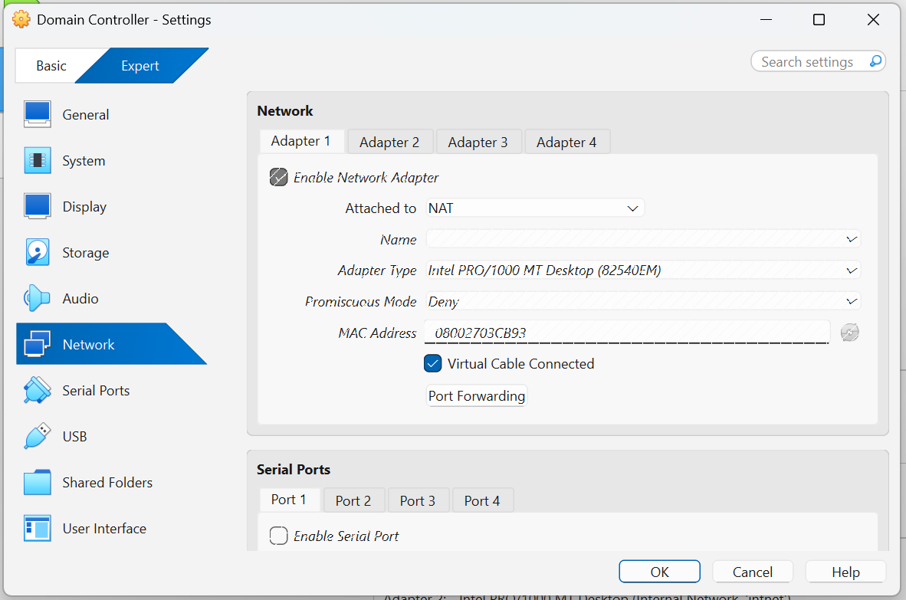
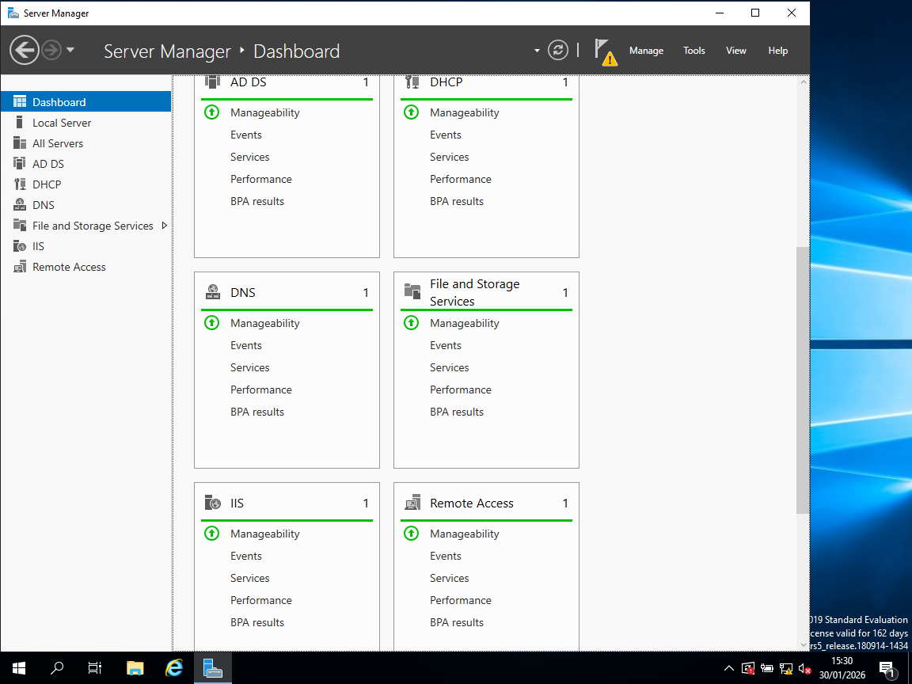
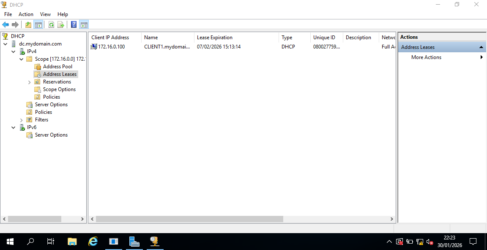
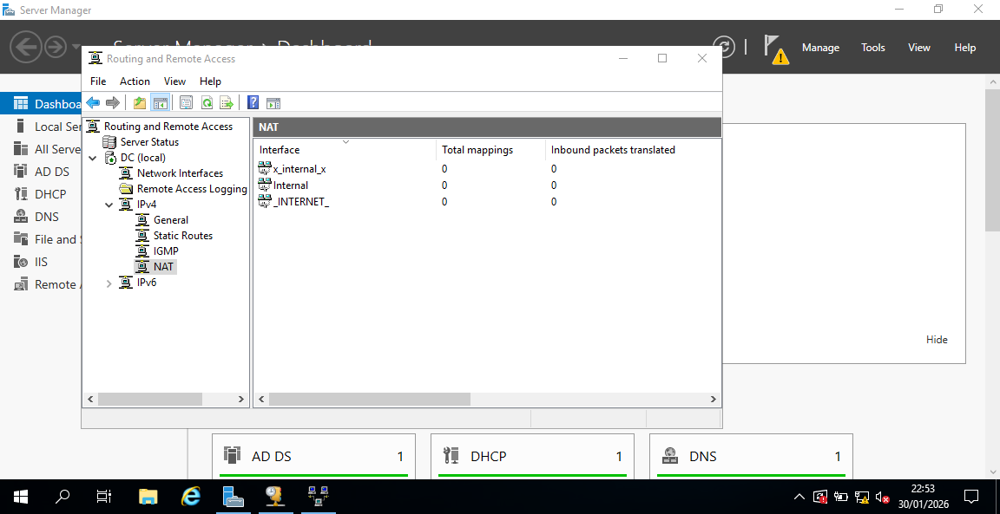
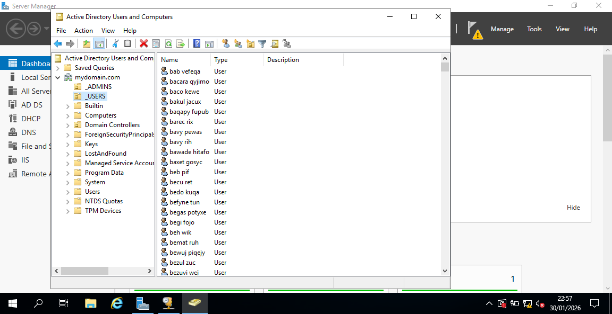

# Active-Directory-Home-Lab-VirtualBox-
📌 Project Overview

This project demonstrates the setup of a Windows Active Directory home lab to simulate a small enterprise environment. The lab includes a Domain Controller, internal networking, automated user creation, and a domain-joined client machine.

The goal was to gain hands-on experience with Active Directory, DNS, DHCP, NAT routing, and PowerShell automation in a realistic setup.

# Architecture Diagram

The lab consists of:

A Windows Server 2019 Domain Controller

A Windows 10 domain-joined client

Internal and NAT networking using VirtualBox

# Technologies Used

Oracle VirtualBox

Windows Server 2019

Windows 10 Pro

Active Directory Domain Services

DNS, DHCP

Routing and Remote Access (NAT)

PowerShell

# Network Configuration

The Domain Controller was configured with two network interfaces:

NAT adapter for internet access

Internal network adapter for client communication

This allows domain clients to access the internet while remaining isolated from the host network.

# Domain Controller Setup

On the Windows Server VM:

Installed Active Directory Domain Services

Promoted the server to a Domain Controller

Created a new domain

# DNS and DHCP Configuration

DNS was automatically configured during domain setup

DHCP was installed to assign IP addresses to domain clients

A DHCP scope was created for the internal network

# NAT and Internet Access

Routing and Remote Access (RRAS) was configured to enable NAT routing, allowing internal domain clients to access the internet through the Domain Controller.

# Organisational Units (OU) Structure

Custom OUs were created to organise domain objects logically, improving manageability and reflecting real-world enterprise structure.

# PowerShell Automation (Bulk User Creation)

A PowerShell script was used to:

Create a dedicated users OU

Automatically generate over 1,000 domain user accounts

Assign passwords and enable accounts

This demonstrated automation and scalability in Active Directory administration.

# Client Machine Configuration

A Windows 10 VM was:

Connected to the internal network

Joined to the Active Directory domain

Logged in using a domain user account

Add screenshot of Windows 10 joined to domain here
Add screenshot of successful domain login here

# Validation & Testing

Verified domain authentication

Confirmed DNS resolution and DHCP leasing

Tested login with multiple generated users

Add screenshot of successful domain user login test here

# Learning Outcomes

Understanding of Active Directory architecture

Hands-on experience with Windows Server roles

Practical PowerShell automation skills

Improved confidence with enterprise identity management

🧹 Cost & Environment Management

This lab was decommissioned after completion to avoid unnecessary resource usage.
The environment can be recreated at any time using the documented steps.
